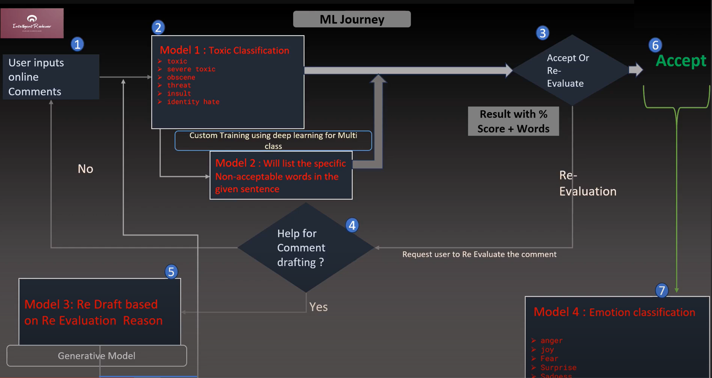

# Content-Moderation-Deep-NLP 
A state-of-the-art NLP tool capable of fine-grained toxicity detection, identifying toxic words and their severity using deep learning transformer architecture. Utilizing advanced LLM techniques for content neutralization and deep emotional analysis. Integrated with Google Dialogflow for a user-friendly conversational interface. I have named this tool as Intelligent Reviewer.

